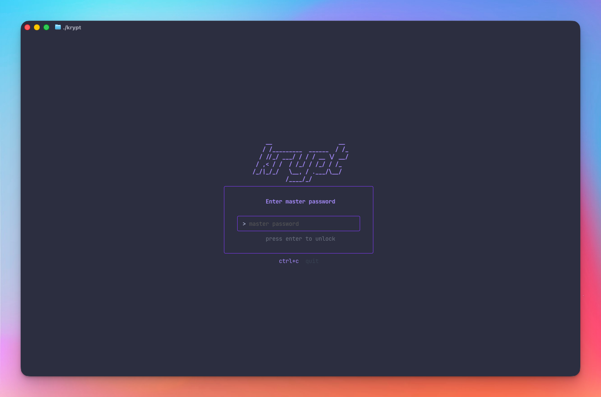
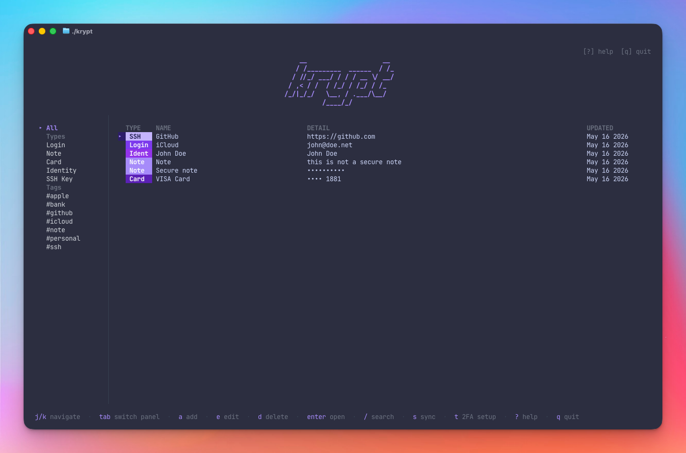
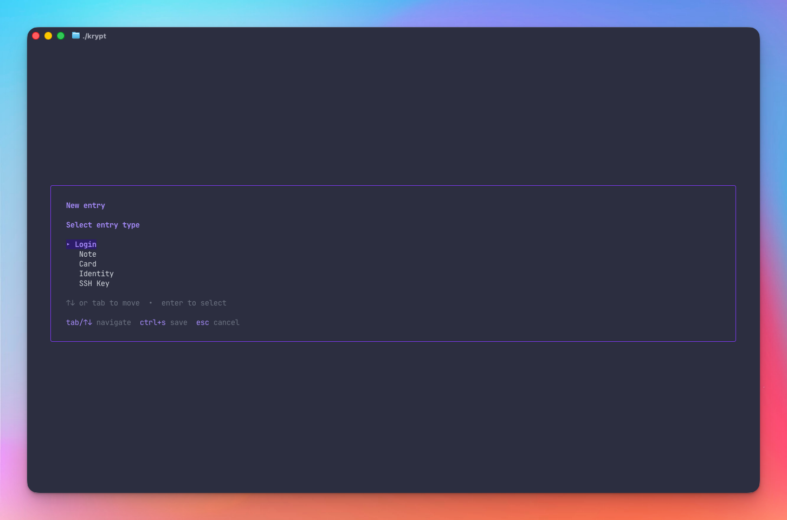
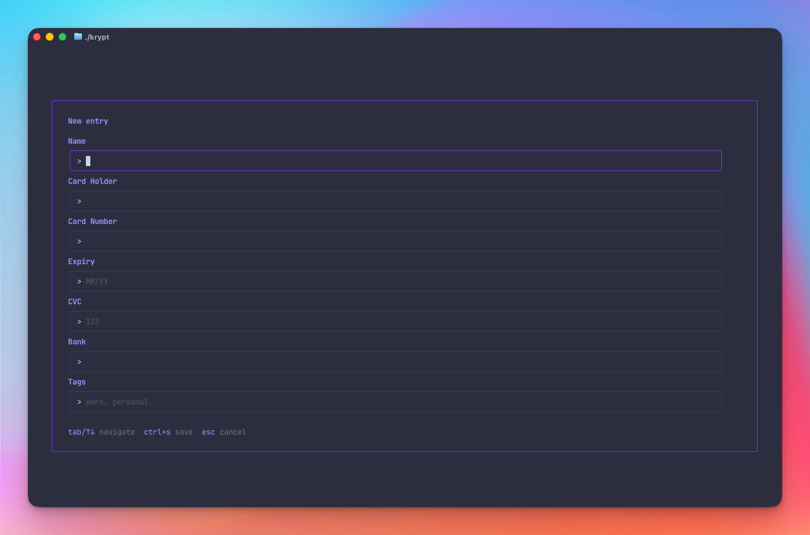
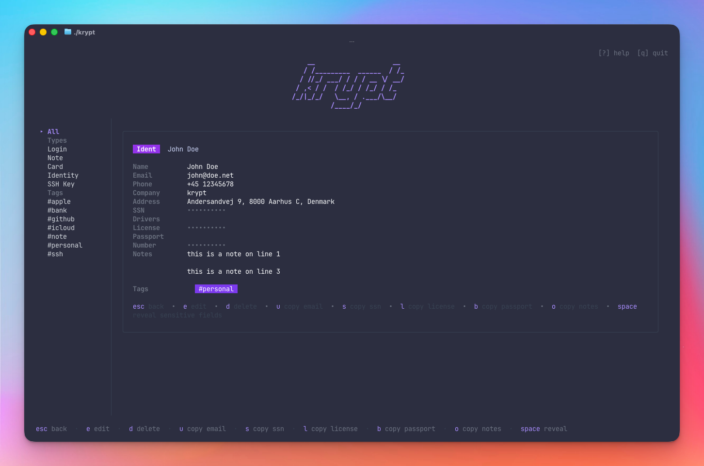
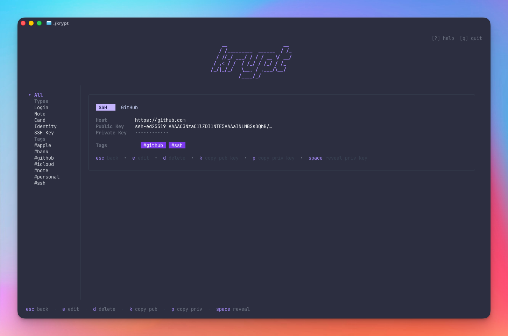

# krypt

A terminal password manager with AES-256-GCM encryption, optional 2FA unlock, and optional GitHub Gist sync.

Built with [Bubble Tea](https://github.com/charmbracelet/bubbletea) + [Lip Gloss](https://github.com/charmbracelet/lipgloss).

```
    __                    __
   / /_________  ______  / /_
  / //_/ ___/ / / / __ \/ __/
 / ,< / /  / /_/ / /_/ / /_
/_/|_/_/   \__, / .___/\__/
          /____/_/
```

---

## Screenshots

<table>
  <tr>
    <td align="center"><br/><sub>Unlock screen</sub></td>
    <td align="center"><br/><sub>Main list view</sub></td>
  </tr>
  <tr>
    <td align="center"><br/><sub>New entry — type picker</sub></td>
    <td align="center"><br/><sub>Add entry form</sub></td>
  </tr>
  <tr>
    <td align="center"><br/><sub>Identity detail view</sub></td>
    <td align="center"><br/><sub>SSH key detail view</sub></td>
  </tr>
</table>

---

## Features

- **5 entry types** — Login, Note, Card, Identity, SSH Key
- **AES-256-GCM encryption** — vault encrypted at rest with your master password
- **Argon2id key derivation** — your password is never stored; only a derived key is used in memory
- **Brute force protection** — max 5 failed unlock attempts; vault destroyed on limit; attempt counter is HMAC-signed to prevent tampering
- **Optional 2FA unlock** — add a TOTP second factor (any authenticator app) to the unlock screen; set up entirely within the TUI
- **Password generator** — generate a strong 30-character password from the main screen (`g`) or inline in the form (`ctrl+g`); copies to clipboard instantly
- **Actions menu** — press `m` to open a compact overlay with quick access to generate password, 2FA setup, and export
- **Export vault** — export all entries as plaintext or AES-256-GCM encrypted JSON (`x`); choose output path; encrypted export requires a one-time passphrase
- **Tag support** — tag entries and filter/search by tag
- **Copy to clipboard** — context-aware copy keybindings per entry type
- **Clickable hyperlinks** — Login URLs rendered as terminal hyperlinks (iTerm2, WezTerm, kitty, Ghostty)
- **Optional GitHub Gist sync** — push your encrypted vault to a private Gist
- **CLI secret retrieval** — `krypt get <name> <field>` and `krypt list` for scripting and automation

---

## Installation

```bash
git clone https://github.com/mojoaar/krypt.git
cd krypt
make install
```

Make sure `~/go/bin` is in your `PATH`:

```bash
export PATH="$PATH:$(go env GOPATH)/bin"
```

Check the installed version:

```bash
krypt --version
```

---

## Data location

| Platform | Path |
|----------|------|
| macOS / Linux | `~/.config/krypt/` |
| Windows | `%AppData%\krypt\` |

Files:

| File | Description |
|------|-------------|
| `vault.enc` | AES-256-GCM encrypted vault |
| `2fa.enc` | Encrypted TOTP secret (only present if 2FA is enabled) |
| `config.json` | Sync + generator settings (unencrypted) |
| `attempts.json` | Failed unlock counter — HMAC-signed; editing it triggers lockout |
| `.vault-secret` | Per-install HMAC signing key (mode `0600`) |

### config.json reference

`~/.config/krypt/config.json` is created automatically. All fields are optional — omit any to use the default.

```json
{
  "sync_enabled": false,
  "gist_id": "",
  "token": "",
  "password_gen": {
    "length": 30,
    "uppercase": true,
    "lowercase": true,
    "digits": true,
    "symbols": true,
    "symbol_set": "!@#$%^&*-_+=?"
  }
}
```

| Field | Default | Description |
|-------|---------|-------------|
| `sync_enabled` | `false` | Enable GitHub Gist sync |
| `gist_id` | `""` | Saved automatically after first push |
| `token` | `""` | GitHub token fallback (prefer `KRYPT_GITHUB_TOKEN` env var) |
| `password_gen.length` | `30` | Generated password length |
| `password_gen.uppercase` | `true` | Include A–Z |
| `password_gen.lowercase` | `true` | Include a–z |
| `password_gen.digits` | `true` | Include 0–9 |
| `password_gen.symbols` | `true` | Include symbols |
| `password_gen.symbol_set` | `!@#$%^&*-_+=?` | Which symbols to use |

---

## Master password

On first launch krypt creates a new vault. **Choose a strong master password — if you lose it, your data cannot be recovered.**

---

## Reset vault

If you need to start fresh (e.g. forgotten master password), press **`ctrl+r`** on the unlock screen to enter the danger zone. Type `delete` to confirm — this permanently removes your vault and all krypt config files. The directory itself (`~/.config/krypt/`) is left in place.

> **This cannot be undone.**

---

## Brute force protection

krypt allows a maximum of **5 failed unlock attempts** (master password and 2FA combined). On the 5th failure:

- `vault.enc` and `2fa.enc` are permanently deleted
- The app exits

The attempt counter resets to 0 on a successful unlock.

`attempts.json` is HMAC-SHA256 signed with a per-install secret stored at `.vault-secret`. Editing `attempts.json` to reset the counter without the signing key causes krypt to treat the file as tampered — the counter is immediately set to the maximum.

---

## 2FA setup (optional)

Press **`t`** from the main screen to open the in-app 2FA setup wizard:

1. krypt generates a TOTP secret and displays it for you to add to your authenticator app (Google Authenticator, Authy, 1Password, etc.)
2. Enter the 6-digit verification code to confirm setup
3. On next launch, krypt will prompt: master password → 6-digit code → vault opens

Press **`t`** again to disable 2FA (removes `2fa.enc`).

> The TOTP secret is stored encrypted at `~/.config/krypt/2fa.enc` — GitHub never sees it.

---

## GitHub Gist sync (optional)

Sync is disabled by default. To enable:

1. Create a GitHub token with `gist` scope at <https://github.com/settings/tokens>
2. Set the environment variable:

```bash
export KRYPT_GITHUB_TOKEN=ghp_...
```

Or add `"token"` and `"sync_enabled": true` to `~/.config/krypt/config.json`.

3. Press `s` inside krypt to push. The Gist ID is saved automatically after the first push.

> The Gist only ever contains the **encrypted** vault — GitHub never sees plaintext.

---

## Entry types

| Type | Fields |
|------|--------|
| **Login** | Name, Username, Password (masked), URL (clickable hyperlink), Notes, Tags |
| **Note** | Name, Content, Tags |
| **Card** | Name, Cardholder, Number (masked), Expiry, CVC (masked), PIN (masked), Notes (multiline), Tags |
| **Identity** | Name, First/Last Name, Email, Phone, Address, Company, SSN (masked), Drivers License (masked), Passport Number (masked), Notes (optional secure), Tags |
| **SSH Key** | Name, Public Key, Private Key (multiline, masked by default), Passphrase (masked), Host, Tags |

---

## Keybindings

### Navigation
| Key | Action |
|-----|--------|
| `j` / `k` or `↑` / `↓` | move up / down |
| `tab` | switch focus: sidebar ↔ list |
| `enter` | open entry detail |
| `esc` | go back |
| `/` | search by name, detail, or tag |

### Entries
| Key | Action |
|-----|--------|
| `a` | add new entry (type picker) |
| `e` | edit selected |
| `d` | delete selected |

### Copy (list or detail view)
| Key | Action |
|-----|--------|
| `u` | copy username (Login) / email (Identity) |
| `p` | copy password (Login) / **private key** (SSH Key) |
| `c` | copy note content (Note) / copy card CVC (Card) |
| `n` | copy card number (Card) |
| `x` | copy card expiry (Card) |
| `i` | copy card PIN (Card) |
| `k` | copy SSH public key |
| `s` | copy SSN (Identity) — in nav mode `s` syncs to Gist instead |
| `l` | copy drivers license (Identity) |
| `b` | copy passport number (Identity) |
| `o` | copy identity notes (Identity) |
| `space` | reveal masked fields (password / card number+CVC / private key / identity notes) |

### In add/edit form
| Key | Action |
|-----|--------|
| `tab` / `↑↓` | navigate fields |
| `ctrl+r` | show / hide masked field (password, CVC, passphrase, private key) |
| `ctrl+g` | generate strong 30-char password (on password / passphrase fields) |
| `ctrl+s` | save entry |
| `esc` | cancel |

### App
| Key | Action |
|-----|--------|
| `m` | open actions menu (generate pw · 2FA · export) |
| `g` | generate strong password and copy to clipboard |
| `t` | 2FA setup / disable |
| `s` | sync to GitHub Gist |
| `x` | export vault (plaintext or encrypted JSON) |
| `?` | toggle help overlay (scrollable) |
| `q` / `ctrl+c` | quit |

> `g`, `t`, and `x` work both directly and from inside the `m` actions menu.

### Unlock screen
| Key | Action |
|-----|--------|
| `ctrl+r` | reset vault (danger zone — type `delete` to confirm) |
| `ctrl+c` | quit |

---

## Export vault

Press `x` on the main screen to open the export wizard.

**Step 1 — Format**

| Key | Format |
|-----|--------|
| `p` | Plaintext JSON — human-readable, no password required |
| `e` | Encrypted JSON — AES-256-GCM, requires a one-time passphrase |

> ⚠ Plaintext export contains unencrypted secrets. Store the file securely and delete it when done.

**Step 2 — Output path**

The default path is `~/krypt-export-YYYY-MM-DD.json` (or `.enc.json` for encrypted).
Edit the path freely; `~` is expanded automatically.

**Step 3 — Passphrase** *(encrypted only)*

Enter and confirm a one-time passphrase. The file is encrypted with Argon2id + AES-256-GCM — the same algorithm used for the vault itself.

**Step 4 — Confirm**

Review the format and path, then press `enter` to write the file.

The export file is written with `0600` permissions (owner read/write only).

---

## CLI usage

krypt can retrieve secrets non-interactively, useful for scripts, dotfiles, and CI.

### Get a secret

```bash
krypt get <name> <field>           # print to stdout
krypt get <name> <field> --copy    # copy to clipboard silently
```

**Examples:**
```bash
krypt get "iCloud" password
krypt get "iCloud" username --copy
krypt get "GitHub SSH" pubkey
krypt get "Visa" number
```

### List entries

```bash
krypt list                    # all entries: [login] iCloud
krypt list --type=login       # filter by type
krypt list --type=ssh
```

### Fields by entry type

| Type | Fields |
|------|--------|
| `login` | `password` `username` `url` `notes` |
| `note` | `content` |
| `card` | `number` `expiry` `cvc` `pin` `holder` `bank` `notes` |
| `identity` | `email` `phone` `address` `company` `ssn` `license` `passport` `firstname` `lastname` |
| `ssh` | `pubkey` `privkey` `passphrase` `host` |

### Master password

```bash
# Interactive prompt (no echo)
krypt get "iCloud" password

# Non-interactive / scripting
KRYPT_MASTER_PASSWORD=your-password krypt list
```

> **2FA note:** 2FA is skipped for CLI commands. The vault is still AES-256-GCM encrypted and requires the master password. 2FA protects the interactive unlock screen, not the vault file itself.

---

## Login URL hyperlinks

When viewing a Login entry, the URL is rendered as a **clickable terminal hyperlink** (`cmd+click` on macOS, `ctrl+click` elsewhere).

Supported terminals: **iTerm2**, **WezTerm**, **kitty**, **Ghostty**. Falls back to plain text in unsupported terminals.

---

## Building

```bash
make build      # all platforms → dist/
make install    # install to ~/go/bin
make clean      # remove dist/
```

Platforms built: `darwin-arm64`, `darwin-amd64`, `linux-amd64`, `linux-arm64`, `windows-amd64`.

Releases use `git tag` for versioning — the version is injected at build time via `git describe --tags`:

```bash
git tag v1.2.0
make build
```

---

## Author

**mojoaar** — <https://github.com/mojoaar>

---

## License

[MIT](LICENSE) © 2026 Morten Johansen

---

## Changelog

### v1.4.3

**Configurable password generator**
- Password generator settings are now configurable in `~/.config/krypt/config.json` under `password_gen`
- Configurable fields: `length`, `uppercase`, `lowercase`, `digits`, `symbols`, `symbol_set`
- Defaults remain the same (30 chars, all character classes, `!@#$%^&*-_+=?` symbols)
- Generator used for both `ctrl+g` in forms and the `g` global keybinding

---

### v1.4.2

**Help overlay**
- `johansen.foo` and `github.com/mojoaar/krypt` are now clickable OSC 8 terminal hyperlinks (cmd+click in iTerm2 / WezTerm / kitty / Ghostty; falls back to plain text elsewhere)
- Added CLI section: `krypt get`, `krypt list`, `krypt help` usage + full field reference per entry type
- Added missing `i` copy card PIN to the copy keybindings reference
- Updated `space` reveal description to include PIN

---

### v1.4.1

**Bug fix — panel overflow**
- List and sidebar now use virtual windowing: only visible rows are rendered, so the layout never overflows regardless of vault size
- List panel shows a `│`/`┃` scrollbar on the right edge when entries exceed the visible height
- Sidebar shows `▲ scroll` / `▼ more` indicators when items extend beyond the panel

---

### v1.4.0

**Card entry improvements**
- Added **PIN** field (masked) — shown as `••••`, revealed with `space` alongside card number and CVC
- Added **Notes** field (multiline textarea) — same pattern as Identity notes
- `i` copies PIN to clipboard in both list and detail views

**CLI secret retrieval**
- `krypt get <name> <field>` — print a secret to stdout
- `krypt get <name> <field> --copy` — copy to clipboard silently
- `krypt list [--type=<type>]` — list all entries with type prefix
- Master password via `KRYPT_MASTER_PASSWORD` env var or secure interactive prompt (no echo)
- 2FA skipped for CLI (vault still AES-256-GCM encrypted; 2FA protects interactive unlock only)
- `krypt help` — full usage reference
- Name matching: exact first, then case-insensitive contains fallback

---

### v1.3.0

**Export vault**
- Press `x` on the main screen to open the export wizard
- Choose plaintext JSON or AES-256-GCM encrypted JSON
- Edit the output path (default `~/krypt-export-YYYY-MM-DD.json`)
- Encrypted export uses Argon2id + AES-256-GCM with a one-time passphrase
- Export files written with `0600` permissions

**Actions menu**
- Press `m` to open a compact overlay with `g` generate password · `t` 2FA setup · `x` export vault
- Direct keys still work from the nav screen for power users
- Bottom hint bar cleaned up — three items replaced with single `m menu` hint

**UX polish**
- Search bar background is now uniform — text input background matches the bar colour

---

### v1.2.0

**Password generator**
- Press `g` on the main screen → generates a 30-char cryptographically random password (uppercase + lowercase + digits + symbols) and copies to clipboard; status clears after 5 seconds
- Press `ctrl+g` on the Password or Passphrase field in the add/edit form → generates and fills the field, auto-revealed so you can see the result; hint shown inline on the label row and in the bottom bar
- Bottom hint bar on main screen cleaned up: removed redundant `? help` and `q quit` (already shown top-right); replaced with `g generate pw`

**Bug fixes**
- Sync via `KRYPT_GITHUB_TOKEN` environment variable now works without requiring `sync_enabled: true` in `config.json` — setting the env var is sufficient

---

### v1.1.0

**Security / UX**
- Vault reset from the unlock screen — press `ctrl+r`, type `delete` to confirm; permanently removes vault and all krypt config files so you can start fresh
- Unlock screen hint bar updated to show `ctrl+r  reset vault`

---

### v1.0.0

Initial release.

**Entry types**
- Login — username, password, URL (clickable hyperlink in supported terminals), notes, tags
- Note — freeform content, tags
- Card — cardholder, number, expiry, CVC; `space` reveals both masked fields at once
- Identity — first/last name, email, phone, address, company, SSN, drivers license, passport number, multiline notes with optional secure toggle, tags
- SSH Key — public key, multiline private key (masked; `ctrl+r` to reveal/paste PEM), passphrase, host, tags; `p` copies private key, `k` copies public key

**Security**
- AES-256-GCM encryption with Argon2id key derivation
- Master password never stored; derived key held in memory only
- Optional TOTP 2FA on the unlock screen (stored encrypted, separate from vault)
- Brute force protection: max 5 attempts; vault destroyed on limit
- `attempts.json` HMAC-signed with a per-install secret — editing the counter without the key triggers lockout

**UX**
- Scrollable add/edit form (handles entry types with many fields)
- Minimum terminal size guard (80×24)
- Context-aware copy keybindings per entry type
- Tag support with sidebar filter
- In-app `?` help overlay with keybinding reference, GitHub sync guide, and 2FA guide
- `krypt --version` / `krypt -v` CLI flag
- Version shown in TUI header and `?` help screen

**Sync**
- Optional GitHub Gist sync — vault pushed as encrypted blob; plaintext never leaves the machine

